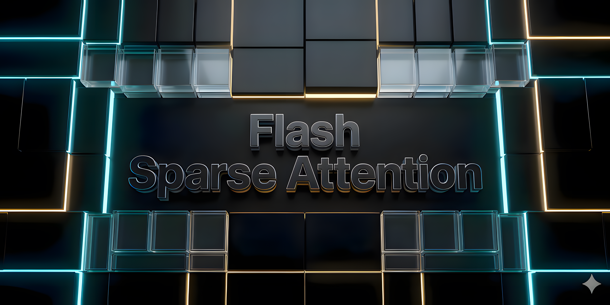
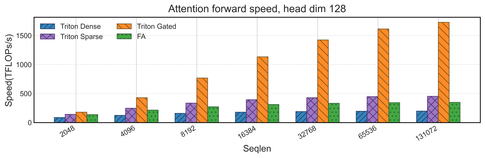
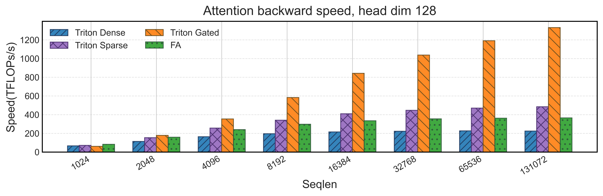
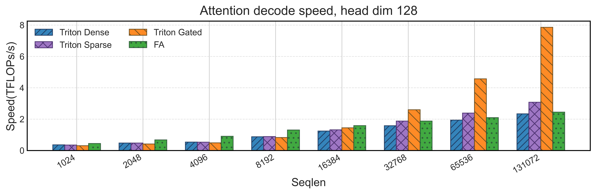

<div align="center">
  
</div>

<div align="center">


**English** | [简体中文](./README_zh.md)

</div>


Flash-Sparse-Attention is a high-performance trainable sparse attention implementation that combines Flash Attention's memory efficiency with sparse computation for handling extremely long sequences in Transformer models.


## Key Features

> [!NOTE]
> Support for arbitrary mask and bias shapes is available in [this branch](https://github.com/HKUSTDial/flash-sparse-attention/tree/final_mask_version). The current main branch no longer maintains that feature set.

### Supported Features

- Forward and backward passes for dense attention, sparse attention, and gated attention
- Regular batched inputs and varlen inputs
- Causal attention and local window attention
- Arbitrary combinations of Q and KV sequence lengths, with head dimensions up to 256
- Grouped Query Attention and Multi Query Attention
- Sparse softmax threshold control
- Gated attention with gate inputs and configurable gating sparsity
- Split-KV path optimization for decoding workloads

### Features We Aim to Support

- Paged Attention
- TMA, WGMMA, and FP8 low precision
- Sequence parallelism


## Installation

### Requirements

- **Linux**: Ubuntu 22.04 or later
- **NVIDIA GPU**: Compute Capability 8.0 or higher
- **Runtime**: NVIDIA driver and runtime compatible with your PyTorch and Triton installation
- **Python**: 3.9 or later
- **PyTorch**: 2.5.1 or later
- **Triton**: Installed automatically as a default dependency

### Install

Install from PyPI:

```bash
pip install flash-sparse-attn
```

To install from source:

```bash
git clone https://github.com/flash-algo/flash-sparse-attn.git
cd flash-sparse-attn
pip install .
```


### Install via HuggingFace Kernel

You can also load the kernels directly from [HuggingFace Kernel](https://github.com/huggingface/kernels) without installing the package:

```python
from kernels import get_kernel

fsa = get_kernel("JingzeShi/flash-sparse-attention", version=1)

out = fsa.flash_dense_attn_func(q, k, v, is_causal=True)
out = fsa.flash_sparse_attn_func(q, k, v, is_causal=True, softmax_threshold=0.01)
out = fsa.flash_gated_attn_func(q, k, v, alpha, delta, is_causal=True)
```

Requires `pip install kernels`.


## Quick Start

### Basic Usage

Below are examples for the three common attention variants:

```python
import torch
from flash_sparse_attn.ops.triton.interface import (
    flash_dense_attn_func,
    flash_sparse_attn_func,
    flash_gated_attn_func,
)

dtype = torch.bfloat16
device = torch.device("cuda")
batch_size, seqlen_q, seqlen_k, num_heads, num_kv_heads, head_dim = 2, 1024, 1024, 8, 2, 64

query = torch.randn(batch_size, seqlen_q, num_heads, head_dim, dtype=dtype, device=device)
key = torch.randn(batch_size, seqlen_k, num_kv_heads, head_dim, dtype=dtype, device=device)
value = torch.randn(batch_size, seqlen_k, num_kv_heads, head_dim, dtype=dtype, device=device)
```

### Dense Attention

Use this when you do not need explicit sparsification but still want an efficient attention kernel.

```python
output_dense = flash_dense_attn_func(
    query=query,
    key=key,
    value=value,
    is_causal=True,
)

print(output_dense.shape)
```

### Sparse Attention

Use this when you want to skip low-contribution attention weights through `softmax_threshold` and reduce effective compute on long sequences.

```python
output_sparse = flash_sparse_attn_func(
    query=query,
    key=key,
    value=value,
    is_causal=True,
    softmax_threshold=1.0,
)

print(output_sparse.shape)
```

### Gated Attention

Use this when you need explicit gating signals for sparse attention. `alpha` controls query-side gating and `delta` controls key-side gating.

```python
alpha = torch.randn(batch_size, num_heads, seqlen_q, device=device, dtype=dtype)
delta = torch.randn(batch_size, num_kv_heads, seqlen_k, device=device, dtype=dtype)

output_gated = flash_gated_attn_func(
    query=query,
    key=key,
    value=value,
    alpha=alpha,
    delta=delta,
    is_causal=True,
    softmax_threshold=1.0,
    gate_threshold=1.0,
)

print(output_gated.shape)
```


## Performance

The following benchmarks were collected on SM120 and cover forward, backward, and decoding workloads. They include Dense, Sparse, and Gated implementations, with FlashAttention as a baseline.

### Forward Performance



### Backward Performance



### Decode Performance




## Benchmarking

Benchmark scripts are located under [tests](tests/), covering forward, backward, and decoding performance.

By default, these scripts use the attention projection layers from the Qwen model family to generate Q, K, and V states with distributions closer to real LLM workloads, and they build input sequences from the Needle-in-a-Haystack dataset.

### Forward Performance

```bash
python tests/benchmark_forward.py
```

### Backward Performance

```bash
python tests/benchmark_backward.py
```

### Decode Performance

```bash
python tests/benchmark_decode.py
```


## Citation

If you use FSA in your research, please cite:

```bibtex
@misc{shi2025trainabledynamicmasksparse,
      title={Trainable Dynamic Mask Sparse Attention},
      author={Jingze Shi and Yifan Wu and Bingheng Wu and Yiran Peng and Liangdong Wang and Guang Liu and Yuyu Luo},
      year={2025},
      eprint={2508.02124},
      archivePrefix={arXiv},
      primaryClass={cs.AI},
      url={https://arxiv.org/abs/2508.02124},
}
```


## Acknowledgments

This project builds upon and integrates several excellent works:

- **[OpenSeek](https://github.com/FlagAI-Open/OpenSeek)** - Kernel development support
- **[Flash-Attention](https://github.com/Dao-AILab/flash-attention)** - Memory-efficient attention computation
- **[NVIDIA CUTLASS](https://github.com/NVIDIA/cutlass)** - High-performance matrix operations library

We thank the open-source community for its contributions to efficient Transformer implementations.