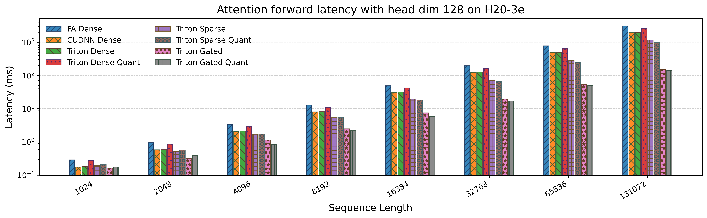
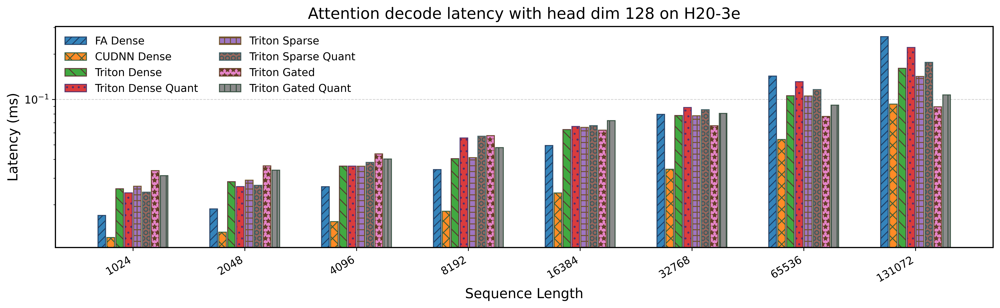
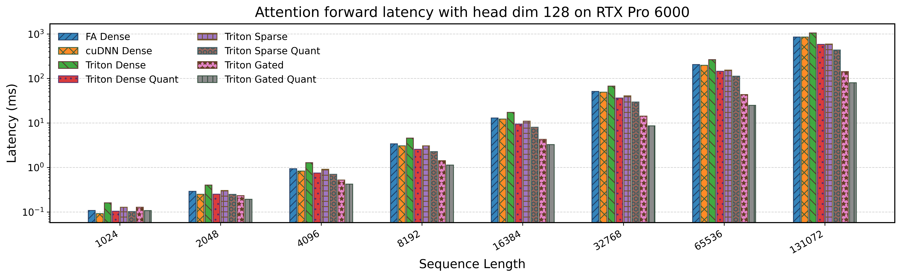
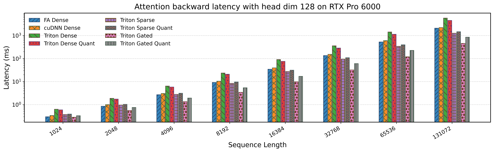
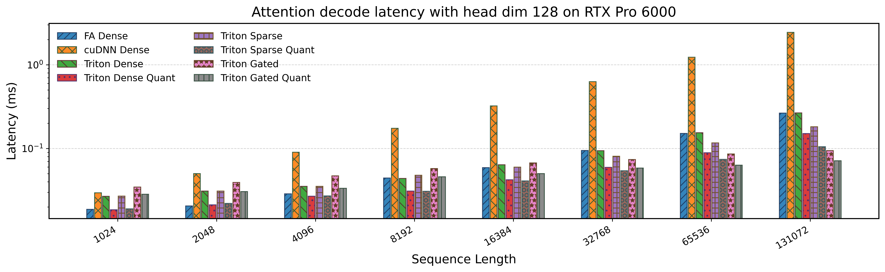
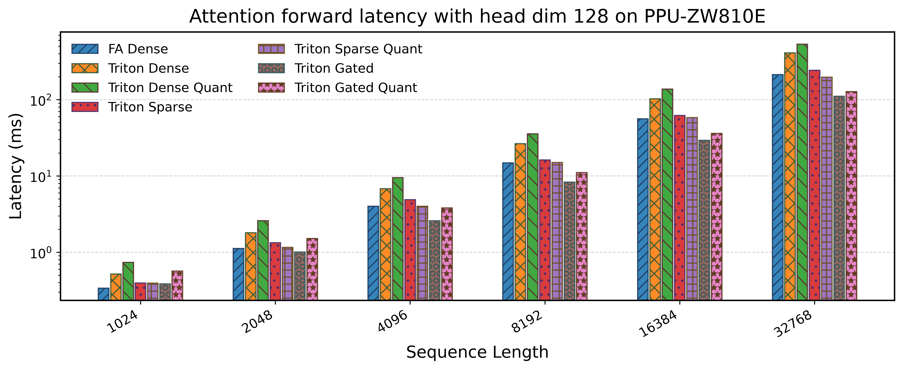
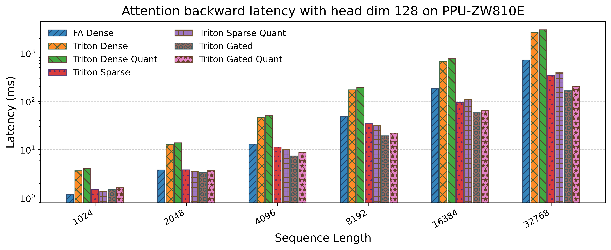
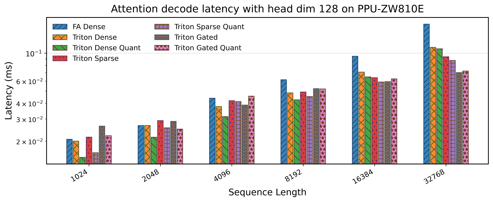

<div align="center">
  
</div>

<div align="center">


[English](./README.md) | **简体中文**

</div>


Flash-Sparse-Attention 是一个高性能的可训练稀疏注意力实现, 将 Flash Attention 的内存效率与稀疏计算能力相结合, 用于在 Transformer 模型中处理超长序列. 


# 主要特性

> [!NOTE]
> 支持任意形状 mask 和 bias 的版本为[这个分支](https://github.com/HKUSTDial/flash-sparse-attention/tree/final_mask_version), 当前主分支不再覆盖这部分功能.

## 支持的功能

- Dense Attention, Sparse attention 和 Gated attention 的前向与反向
- 常规批次输入与 varlen 输入
- 因果注意力与局部窗口注意力
- 任意 Q / KV 序列长度组合, 以及小于等于 256 的头维度
- 分组查询注意力和多查询注意力
- 稀疏 softmax 阈值控制
- gated attention 支持门控输入, 以及控制门控稀疏程度
- Flex Local Window Attention 支持逐head的任意窗口大小和局部范围
- Split-KV 适用于前向和解码的工作负载均衡
- Split-QO 适用于反向的工作负载均衡
- Fused Quant 支持非FP8原生支持的硬件使用低精度计算

## 我们想要支持的功能

- 分页注意力
- KV-Cache 管理器
- [TLE](https://github.com/flagos-ai/FlagTree/wiki/TLE) 后端支持
- [Gluon](https://github.com/triton-lang/triton/tree/main/python/triton/experimental/gluon) 后端支持


# 安装

## 依赖

- **Linux**: Ubuntu 22.04 或更高版本
- **NVIDIA GPU**: 计算能力 8.0 或更高
- **运行环境**: 需要与 PyTorch 和 Triton 兼容的 NVIDIA 驱动与运行时环境
- **Python**: 3.9 或更高版本
- **PyTorch**: 2.5.1 或更高版本
- **Triton**: 作为默认依赖自动安装

## 安装

直接安装：

```bash
pip install flash-sparse-attn
```

如果您希望从源码安装：

```bash
git clone https://github.com/flash-algo/flash-sparse-attn.git
cd flash-sparse-attn
pip install .
```


## 通过 HuggingFace Kernel 使用

也可以直接从 [HuggingFace Kernel](https://github.com/huggingface/kernels) 加载 kernel，无需安装本包：

```python
from kernels import get_kernel

fsa = get_kernel("JingzeShi/flash-sparse-attention", version=1)

out = fsa.flash_dense_attn_func(q, k, v, is_causal=True)
out = fsa.flash_sparse_attn_func(q, k, v, is_causal=True, softmax_threshold=0.01)
out = fsa.flash_gated_attn_func(q, k, v, alpha, delta, is_causal=True)
```

需要先安装 `pip install kernels`。


# 快速开始

## 基本用法

下面是三类常见用法示例：

```python
import torch
from flash_sparse_attn.ops.triton.interface import (
    flash_dense_attn_func,
    flash_sparse_attn_func,
    flash_gated_attn_func,
)

dtype = torch.bfloat16
device = torch.device("cuda")
batch_size, seqlen_q, seqlen_k, num_heads, num_kv_heads, head_dim = 2, 1024, 1024, 8, 2, 64

query = torch.randn(batch_size, seqlen_q, num_heads, head_dim, dtype=dtype, device=device)
key = torch.randn(batch_size, seqlen_k, num_kv_heads, head_dim, dtype=dtype, device=device)
value = torch.randn(batch_size, seqlen_k, num_kv_heads, head_dim, dtype=dtype, device=device)
```

### Dense Attention

适用于不需要显式稀疏化, 但仍希望获得高效 attention 计算的场景。

```python
output_dense = flash_dense_attn_func(
    query=query,
    key=key,
    value=value,
    is_causal=True,
)

print(output_dense.shape)
```

### Sparse Attention

适用于希望通过 `softmax_threshold` 跳过低贡献注意力权重, 在长序列上减少有效计算量的场景。

```python
output_sparse = flash_sparse_attn_func(
    query=query,
    key=key,
    value=value,
    is_causal=True,
    softmax_threshold=1.0,
)

print(output_sparse.shape)
```

### Gated Attention

适用于需要显式门控信号的稀疏注意力场景。`alpha` 控制 query 侧门控, `delta` 控制 key 侧门控。

```python
alpha = torch.randn(batch_size, num_heads, seqlen_q, device=device, dtype=dtype)
delta = torch.randn(batch_size, num_kv_heads, seqlen_k, device=device, dtype=dtype)

output_gated = flash_gated_attn_func(
    query=query,
    key=key,
    value=value,
    alpha=alpha,
    delta=delta,
    is_causal=True,
    softmax_threshold=1.0,
    gate_threshold=1.0,
)

print(output_gated.shape)
```


# 性能

以下基准测试涵盖前向、后向和解码工作负载。其中包括密集型、稀疏型和门控实现，并以FlashAttention作为基线。

## NVIDIA GPU

### H20

**前向传播性能**



**反向传播性能**


**解码性能**




### RTX PRO 6000

**前向传播性能**



**反向传播性能**



**解码性能**




## T-Head PPU

### ZW810E

**F前向传播性能**



**反向传播性能**



**解码性能**




# 基准测试

基准测试脚本位于 [tests](tests/) 下, 用于评估前向、反向和解码三类场景下的性能。

## 前向传播性能

```bash
python tests/benchmark_forward.py
```

## 反向传播性能

```bash
python tests/benchmark_backward.py
```

## 解码性能

```bash
python tests/benchmark_decode.py
```


# 引用

如果您在研究中使用 FSA, 请引用：

```bibtex
@misc{shi2025trainabledynamicmasksparse,
      title={Trainable Dynamic Mask Sparse Attention}, 
      author={Jingze Shi and Yifan Wu and Bingheng Wu and Yiran Peng and Liangdong Wang and Guang Liu and Yuyu Luo},
      year={2025},
      eprint={2508.02124},
      archivePrefix={arXiv},
      primaryClass={cs.AI},
      url={https://arxiv.org/abs/2508.02124}, 
}
```

# 致谢

本项目基于并集成了几个优秀的工作：

- **[OpenSeek](https://github.com/FlagAI-Open/OpenSeek)** - 内核开发支持
- **[Flash-Attention](https://github.com/Dao-AILab/flash-attention)** - 内存高效的注意力计算
- **[NVIDIA CUTLASS](https://github.com/NVIDIA/cutlass)** - 高性能矩阵运算库

我们感谢开源社区对高效 Transformer 实现的贡献. 🤗
